# Using the Cryo3D Editor — User Guide

A hands-on guide to cleaning, colouring, rendering and exporting cryo-ET
segmentations with the **Cryo3D Editor** plugin for [napari](https://napari.org).

> **What you will learn**
> - Open napari and load a tomogram and its segmentation.
> - Open the Cryo3D Editor plugin.
> - Use each of the five tabs: **Dust**, **Erase**, **Colors**, **Render**, **Movie**.
> - Export your results as an image or a new `.mrc` file.

---

## Table of contents

1. [Installation](#1-installation)
2. [Getting started — load your data](#2-getting-started--load-your-data)
3. [Open the plugin](#3-open-the-plugin)
4. [The five tabs](#4-the-five-tabs)
5. [Dust — remove small objects & erode](#5--dust--remove-small-objects--erode)
6. [Erase — paint out regions](#6--erase--paint-out-regions)
7. [Colors — recolour, merge & delete labels](#7--colors--recolour-merge--delete-labels)
8. [Render — view & export (incl. Save as MRC)](#8--render--view--export-incl-save-as-mrc)
9. [Movie — animations & spin movies](#9--movie--animations--spin-movies)
10. [A typical workflow](#10-a-typical-workflow)
11. [Troubleshooting](#11-troubleshooting)

---

## 1. Installation

The plugin is **not on PyPI yet**, so install it from the source. Use an
environment that already has napari, then:

```bash
# From a local clone (recommended while editing):
cd cryo3d-editor
pip install -e .

# …or directly from GitHub:
pip install "git+https://github.com/lifeviewspace/cryo3d-editor.git"
```

> A Qt backend (PyQt5/PyQt6) is required — napari already provides one.
> The `[gpu]` extra (CuPy) is optional and **not** available on Apple Silicon;
> the plugin always falls back to CPU.

---

## 2. Getting started — load your data

Launch napari from a terminal:

```bash
napari
```

**Open your file** with **File → Open File(s)…** (or just drag it into the window).

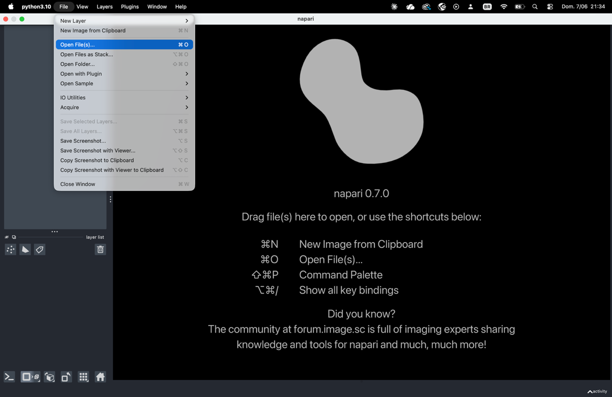

Select your tomogram (`.mrc`/`.rec`) and/or your segmentation. You can select
several files at once.

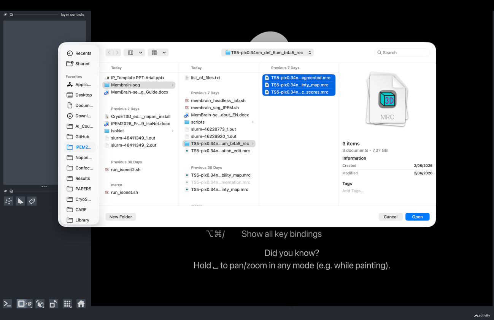

Once loaded, the layer list (bottom-left) shows your layers and the canvas shows
one Z-slice of the volume. Scroll to move through Z.

> **Image vs Labels.** An **Image** layer is the raw greyscale density. A
> **Labels** layer is the segmentation: integers where `0` = background and
> `1, 2, 3…` are different objects. Most cleanup tools act on **Labels**.
> If a segmentation loads as an Image, right-click it in the layer list and
> choose **Convert to Labels**.

As shown below, your loaded layers appear in the list on the left; the topmost
layer is drawn on top in the canvas.

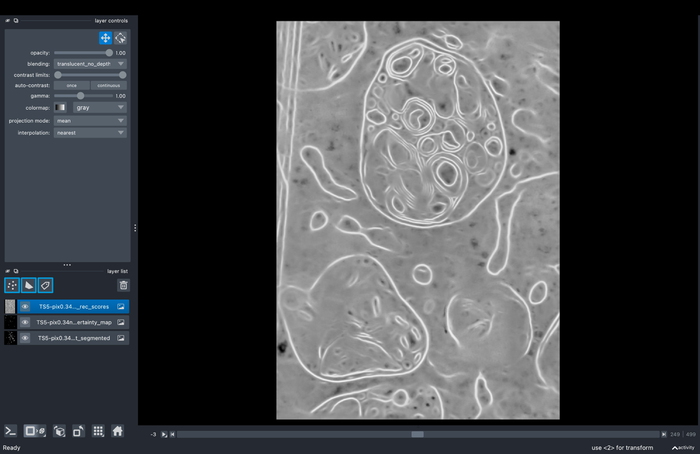

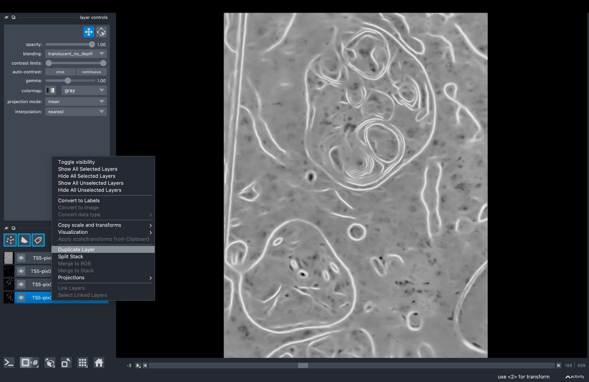

When displayed as Labels, each object gets its own colour:

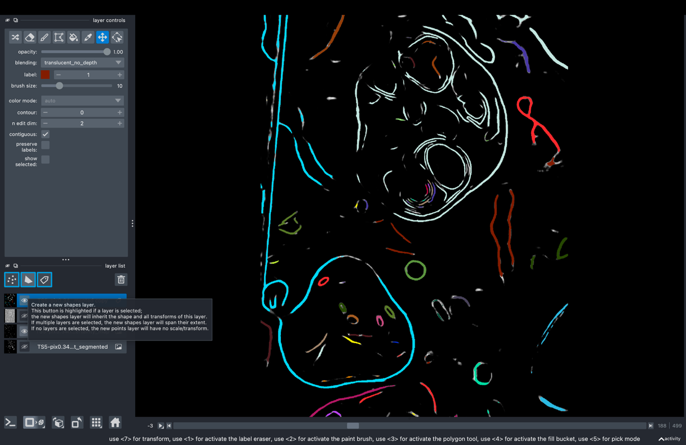

---

## 3. Open the plugin

Go to the **Plugins** menu and click **Cryo3D Editor**.

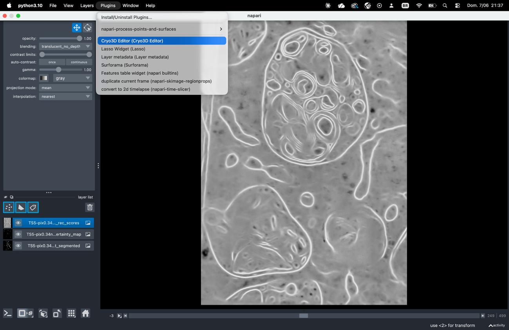

The plugin panel docks on the right, with five tabs across the top. Pick the
layer you want to work on in each tab's selector first.

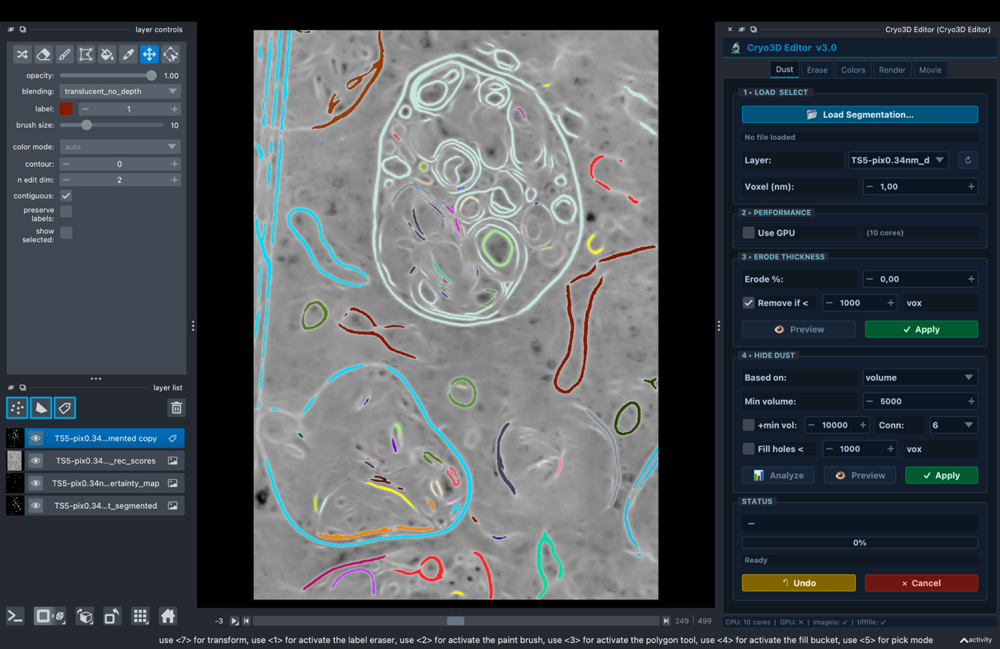

> **Notice the layer dropdown** in the plugin panel (top-left of the screenshot
> above) — use it to select which layer you're working on.

> **Tip — each tab has its own layer selector.** You can work on different
> layers in different tabs; selecting a layer in one tab doesn't change the
> others.


*Navigate through Z-slices by scrolling to explore the full 3D volume. This helps
you understand your data structure before editing.*

---

## 4. The five tabs

| Tab | What it does | Typical use |
|-----|--------------|-------------|
| 🧹 **Dust** | Remove small objects; shrink objects (per-object erosion) | Cleaning noisy segmentations |
| ✂️ **Erase** | 2D paint-mask eraser for Labels layers | Manually deleting wrong regions |
| 🎨 **Colors** | Per-label colour, opacity, merge, presets | Making structures readable |
| 💡 **Render** | Lighting, contrast, presets, snapshot, **Save as MRC** | Publication views & export |
| 🎬 **Movie** | Keyframe 3D animation + 360° spin movie | Talks, papers, outreach |

**Natural order:** clean (Dust/Erase) → tidy labels (Colors) → style (Render) →
export → optional animation (Movie).

---

## 5. 🧹 Dust — remove small objects & erode

**Why:** automatic segmentations contain tiny specks ("dust") and structures
that are too thick. This tab cleans both.

1. **1 ▸ Load & Select** — click **📂 Load Segmentation…** or pick a Labels
   layer in the dropdown. Use **↻** to refresh the list.
2. **2 ▸ Performance** — tick **Use GPU** only if you have an NVIDIA GPU.
3. **3 ▸ Erode Thickness** — set the erosion percentage to shrink each object;
   tick **Remove if <** to delete objects that vanish. Click **👁 Preview**,
   then **✓ Apply**.
4. **4 ▸ Hide Dust** — choose a **metric** (`volume`, `area`, `size`, or their
   `rank` versions), set the threshold, then **📊 Analyze** → **👁 Preview** →
   **✓ Apply**.

| Control | What it does | Typical value |
|---------|--------------|---------------|
| Use GPU | Routes erosion/labeling to CuPy if available | Off (macOS) |
| Erode percentage | Shrinks each object by this % of its thickness | 10–30 % |
| Remove if < | Deletes objects that disappear after erosion | On for cleanup |
| Metric | How "small" is measured; `rank` keeps only the top-N largest | volume |
| Connectivity | Which voxels count as touching: 6, 18 or 26 neighbours | 6 or 26 |
| Fill holes < | Closes small holes inside objects | optional |

> **Always Preview before Apply.** Preview shows the result without changing your
> data. Only **✓ Apply** edits the layer; use **↶ Undo** (STATUS section) to revert.

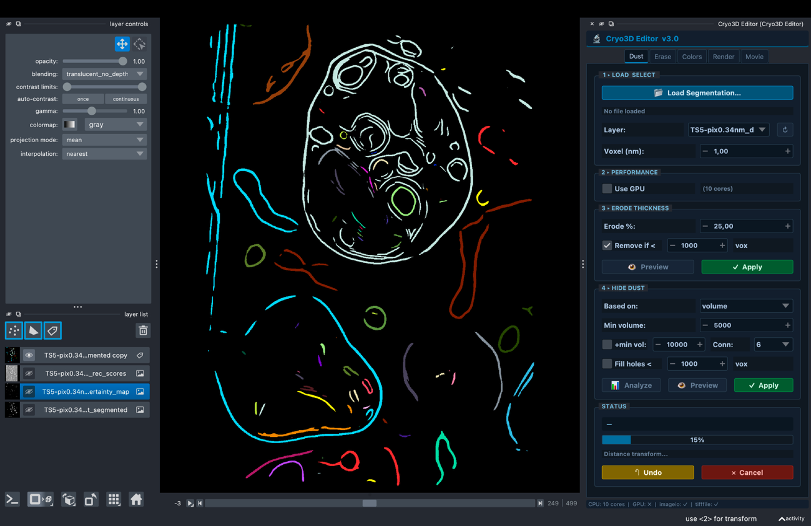
*Original segmentation, before cleaning.*

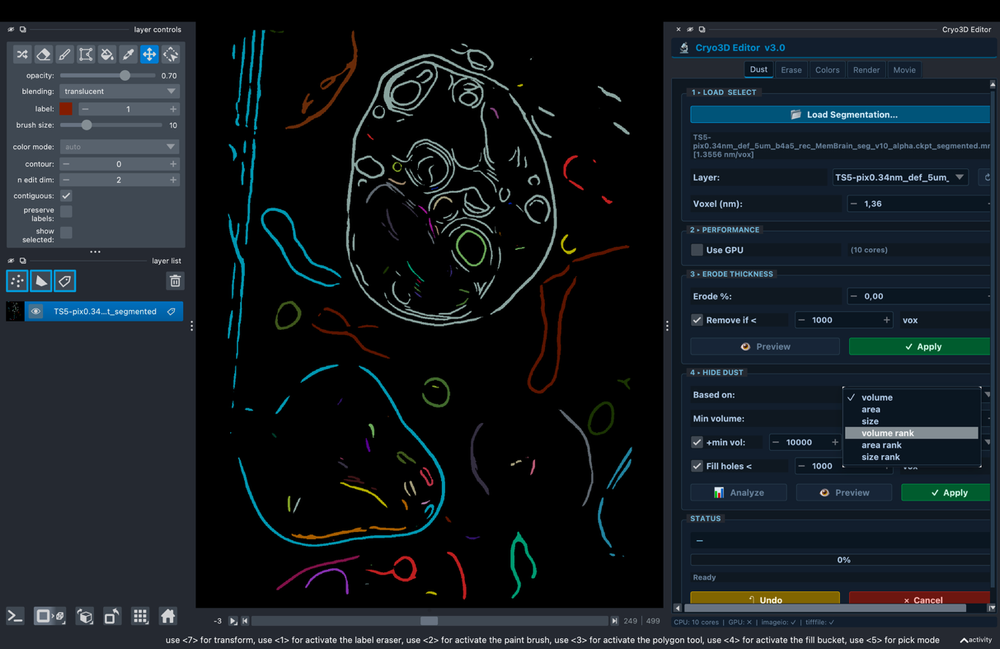
*Preview after **Hide Dust** — the small specks are gone.*

---

## 6. ✂️ Erase — paint out regions

**Why:** some errors are in the wrong place, not just small. Paint a mask by hand
and delete whatever it covers.

1. **1 ▸ Select Layer** — choose the Labels layer.
2. **2 ▸ Paint Mask** — click **🖌 Create Mask**; a red mask layer appears in
   paint mode. Drag on the canvas to paint over regions to remove.
   **🗑 Clear Mask** starts over.
3. **3 ▸ Z Range** — tick **All Z slices**, or set start/end slices to limit the
   depth range.
4. **4 ▸ Actions** — click **✂️ Apply Erase** to delete the painted voxels;
   **↶ Undo** reverts.

> **Brush controls.** While the mask layer is active, change the **brush size**
> with napari's brush slider or the <kbd>[</kbd> / <kbd>]</kbd> keys.

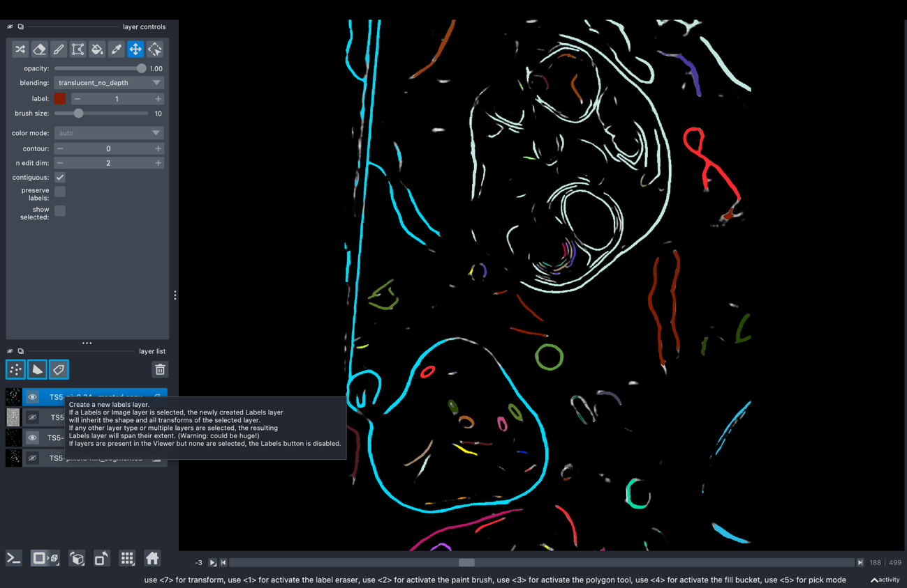

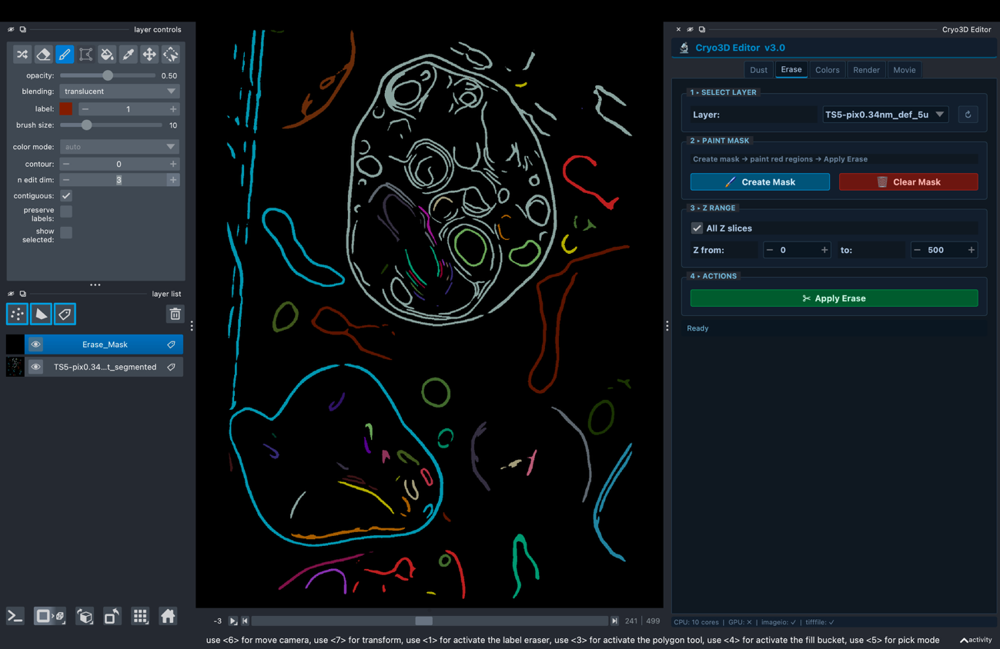
*Erasing the unknown segmentation — paint a mask, then **Apply Erase**. You can
also erase portions directly with napari's own brush tools.*

---

## 7. 🎨 Colors — recolour, merge & delete labels

**Why:** to interpret a segmentation you need to tell structures apart and fix
over-segmentation.

1. **Layer** — pick the Labels layer.
2. **Labels list** — click a label to select it; hold <kbd>Ctrl</kbd> and click
   to select several.
3. **Color & Opacity** — click **🎨 Pick Color** (or a preset) to recolour, and
   use the opacity slider to fade labels.
4. **Actions:**
   - **🎯 Go to** — jump the view to the selected label.
   - **🗑 Erase Label** — delete the selected label(s).
   - **🔗 Merge** — combine several selected labels into one.
   - **🔄 Reset Colors** — restore the default random colour scheme.

> **Merging fixes over-segmentation.** Automatic methods often split one real
> object into several labels. Select the pieces with <kbd>Ctrl</kbd>+click and
> press **🔗 Merge** so they become a single object before measuring or exporting.


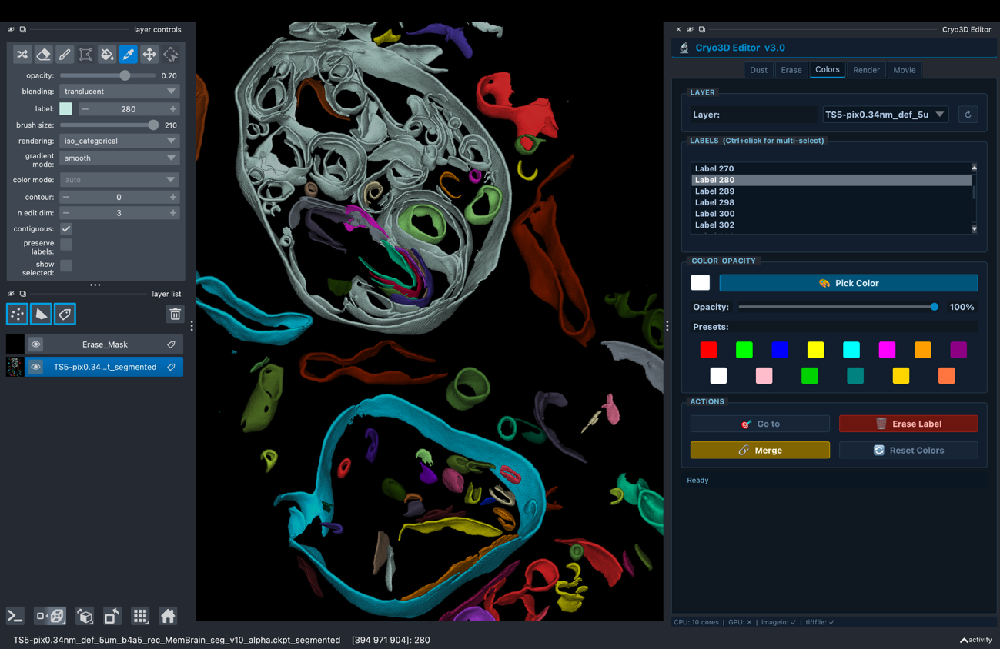
*Colorizing the labels/membranes — select a label and change its colour.*

---

## 8. 💡 Render — view & export (incl. Save as MRC)

**Why:** the same data looks flat or striking depending on contrast, lighting and
rendering mode. This tab also exports your results.

1. **1 ▸ Select Layer** (Image or Labels).
2. **2 ▸ Contrast / Opacity & Gamma** — adjust the sliders; **⚡ Auto Contrast**
   picks good limits. For Labels, the sliders control opacity.
3. **3 ▸ Rendering Mode (3D)** — `mip`, `translucent`, `attenuated_mip`, `iso`,
   `average`, `minip`. Set ISO threshold / attenuation when relevant.
4. **4 ▸ Colormap** — pick a colour scheme for Image layers.
5. **5 ▸ Membrane Presets** — **🧬 Membrane**, **🌫 Dense Volume**,
   **🔵 ISO Surface**, or **🔄 Reset to Default**.
6. **6 ▸ Save Snapshot as TIFF** — tick **Canvas only**, then **📸 Save Snapshot…**.
7. **7 ▸ Save as MRC** — tick **Binary mask** to save Labels as 0/1, then
   **💾 Save as MRC…**.

| Rendering mode | Best for |
|----------------|----------|
| `mip` (max intensity) | Bright structures on dark background — the default |
| `attenuated_mip` | Dense/crowded volumes |
| `iso` | Clean surface view of a thresholded object |
| `translucent` / `average` / `minip` | Specialised looks |

> **Save as MRC keeps the voxel size.** The exported `.mrc` writes the voxel size
> into its header (nm → Å) and chooses the right data type automatically:
> `int16` for label masks, `int8` for binary masks, `float32` for tomograms.
> It opens correctly in IMOD, ChimeraX and napari.

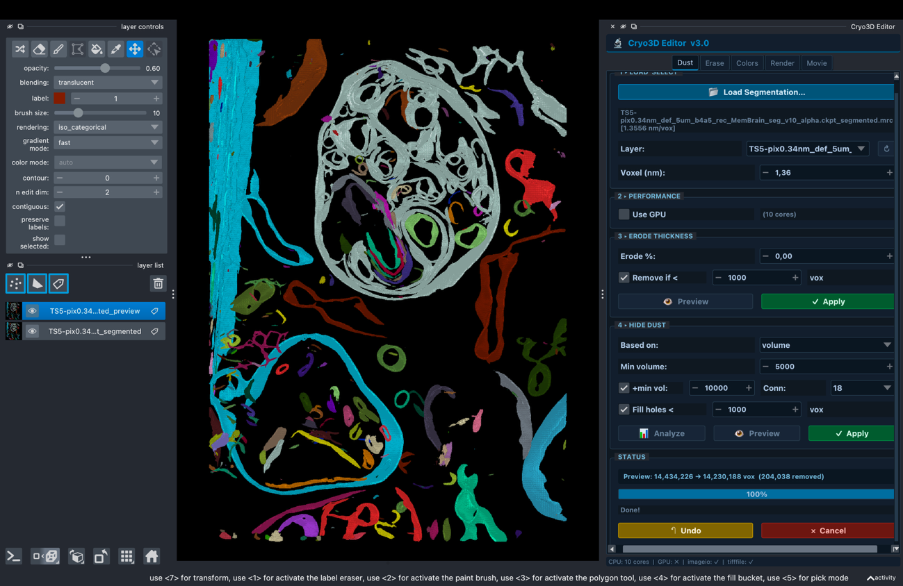
*Visualizing the cleaned segmentation in 3D (toggle 2D/3D with napari's
dimension-display button).*


*Saving the canvas image through **Save Snapshot…**.*

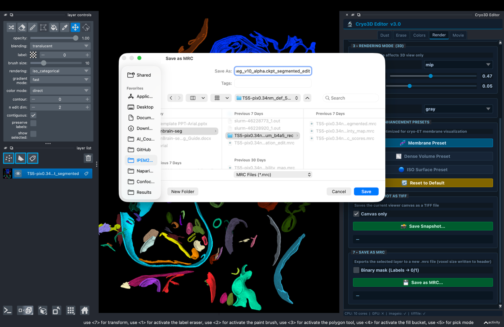
*Saving the cleaned segmentation as an `.mrc` file.*

---

## 9. 🎬 Movie — animations & spin movies

**Why:** 3D structures are far clearer in motion. This tab has two sub-tabs.

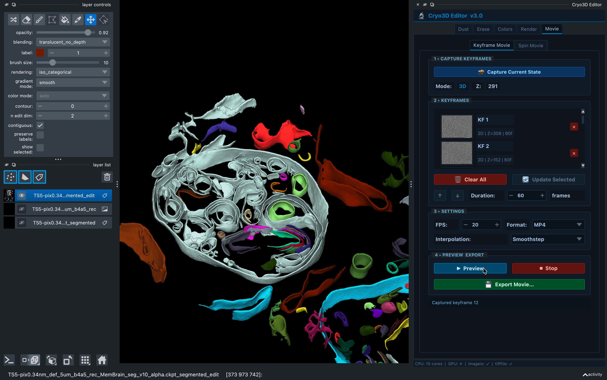

**Keyframe Movie** — animate a camera path between viewpoints you choose.

1. **1 ▸ Capture Keyframes** — set the 3D view (rotate, zoom, pick the slice),
   then click **📸 Capture Current State**. Repeat for each viewpoint; the panel
   shows a thumbnail per keyframe (KF 1, KF 2, …). You need **at least two**.
2. **2 ▸ Keyframes** — reorder with **↑/↓**, replace one with **🔄 Update
   Selected**, set **Duration** (frames between this keyframe and the next), or
   **🗑 Clear All**.
3. **3 ▸ Settings** — **Format** (`MP4`, `GIF`, `PNG Sequence`), **Interpolation**
   (`Smoothstep`, `Linear`, `Ease-in`, `Ease-out`), and **FPS**.
4. **4 ▸ Preview & Export** — **▶ Preview** plays the path on the canvas (**■ Stop**
   to interrupt). When happy, click **💾 Export Movie…** and choose where to save.

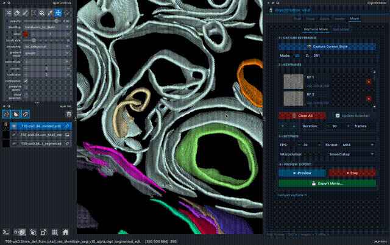

*Short preview of a keyframe animation.*

▶️ **Full walkthrough:** [watch the complete Movie-tab demo](https://github.com/lifeviewspace/cryo3d-editor/raw/main/images/tut/movie_tab_demo.mp4)
(`images/tut/movie_tab_demo.mp4`) — capturing keyframes, setting duration and
interpolation, previewing and exporting.

<video src="https://github.com/lifeviewspace/cryo3d-editor/raw/main/images/tut/movie_tab_demo.mp4" controls width="100%"></video>

**Spin Movie** — one-click automatic 360° turntable.

1. **1 ▸ Rotation Settings** — pick the axis (`Y`, `X`, `Z`) and output format.
2. **2 ▸ Export** — click **🌀 Start Spin Movie…**. **✕ Cancel** stops it.

> **Set up the look first** in the Render tab — the movie records exactly what is
> on the canvas (colours, opacity, rendering mode).

> **MP4 won't open?** Exports use H.264 + `yuv420p`, which plays in QuickTime,
> VLC and browsers. If an export ever fails, the status bar shows *"Export
> failed — see terminal log"* and the full error is printed in the terminal you
> launched napari from — copy that text when reporting an issue.

---

## 10. A typical workflow

```
Load data  →  Clean (Dust + Erase)  →  Tidy labels (Colors)
           →  Style view (Render)   →  Export (MRC / TIFF / Movie)
```

Use **Undo** freely at any stage.

---

## 11. Troubleshooting

| Situation | What to do |
|-----------|------------|
| My layer isn't in the dropdown | Click the **↻** refresh button next to the layer selector |
| An operation says "Select layer" | Pick a layer in the tab's selector first |
| I applied something by mistake | Use **↶ Undo** (Dust and Erase tabs keep a history) |
| Preview looks right but nothing changed | Preview never edits data — click **✓ Apply** |
| `No matching distribution found` on install | The package is not on PyPI; install from local or GitHub (see [Installation](#1-installation)) |
| Plugin missing from the Plugins menu | Re-run `pip install -e .` in the active environment |
| 3D view is slow or hangs on large volumes | Switch to 2D, reduce canvas size, or crop the region |
| Colours look wrong after editing (napari 0.7) | Press **🔄 Reset Colors**; make sure you're on the latest version |
| Movie export fails or the MP4 won't play | Make sure `imageio-ffmpeg` is installed; check the terminal for the printed traceback. Frames are auto-resized to even dimensions, so a mid-export crash is usually a missing ffmpeg backend |
| Exported video is blank/grey | The movie records the canvas — set the view in **Render** first and keep the napari window visible during export |

---

*Cryo3D Editor v3.0 — tabs: Dust · Erase · Colors · Render · Movie ·
[github.com/lifeviewspace/cryo3d-editor](https://github.com/lifeviewspace/cryo3d-editor) ·
Author: Kennedy Bonjour (lifeviewspace).*
